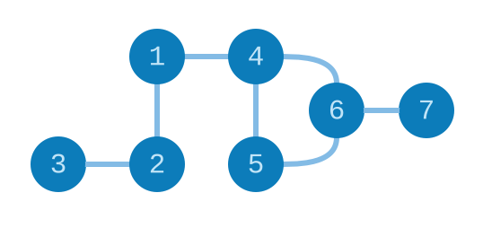
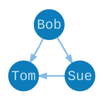

# Graphs

The term “graph” has a very specific meaning in Computer Science. It refers specifically to a network of connections, like this:



The numbered circles are called *nodes* and the lines between them are called *edges*. Examples of graphs include:

  - **Facebook Friends** &mdash; Each node is a *person* and each edge is a *friendship*. That means person `1` is friends with `2` and `4`. We may want to ask, who is the person with the most friends? Who are my friends-of-friends?

  - **Train Maps** &mdash; Each node is a *town* and each edge is a *train track*. So if I live in town `6` I can take a train directly to town `7` with no stops. We may want to ask, what is the shortest path from town `1` to town `6`?

In both of these examples, the edges are two-way. If there are train tracks between towns `1` and `2`, you can go across them in either direction. These two-way edges are called *undirected edges*, and a graph made up of undirected edges is called an *undirected graph*.

In practice, it is far more common to use one-way edges, or *directed edges*. A *directed graph* looks like this:


Notice that the edges switched from lines to arrows. Examples of this kind of graph include:

  - **Twitter Follows** &mdash; Each node is a *person* and each edge is a *follow*. So person `1` follows `2` and `4`, but they do not follow back. Person `2` and `3` follow each other. We may want to ask if a tweet from `4` will ever be seen by `6` through retweets? Can a tweet from `4` ever be seen by `7` through retweets?

  - **The Internet** &mdash; Each node is a *web page* and each edge is a *link* from page-to-page. Page `4` only has one outgoing link, pointing to page `6`. If there are tons of link to particular pages, maybe that is a proxy for how important that page is.

  - **Elm Modules** &mdash; Each node a `module` and each edge represents an `import`. It looks like modules `2` and `3` import each other, so we have a cyclic dependency. To compile `2` we need `3` to be compiled, which needs `2` to be compiled, which needs `3` to be compiled, etc. No good! So we would definitely want to know if this graph has any cycles.

When writing a compiler, you have to deal with directed graphs all the time. It is kind of crazy. Anyway, now that we know the two basic types of graphs, how do we represent them in Elm?


## Graphs in Elm

Graphs are easy to represent in Elm thanks to dictionaries! So imagine we wanted to represent this tiny graph of Twitter users:



We can represent it in Elm like this:

```elm
import Dict exposing (Dict)

graph : Dict String (List String)
graph =
  Dict.fromList
    [ ( "Bob", ["Sue", "Tom"] )   -- Bob follows Sue and Tom.
    , ( "Sue", ["Tom"] )          -- Sue only follows Tom.
    , ( "Tom", [] )               -- Tom does not follow anyone!
    ]
```

So if we wantned to know how many followers someone has, we could say:

```elm
countFollowers : String -> Dict String (List String) -> Int
countFollowers name graph =
  let
    addFollow _ follows count =
      if List.member name follows then
        count + 1
      else
        count
  in
    Dict.foldl addFollow 0 graph
```

This function visits each person in the Twitter graph, and then ask if this person follows a partucilar individual. It would be really expensive to crawl *all* twitter users any time you wanted a follower count though! Fortunately, we can just add some additional information to our graph representation.

```elm
import Dict exposing (Dict)

type alias TwitterGraph =
  Dict String User

type alias User =
  { displayName : String
  , following : List String
  , followers : Int
  , biography : String
  , picture : String
  }
```

Now the data for a person includes `followers` like before, but also a bunch of other useful information. If we want to know someone’s follower count, we can just look it up directly now. This same technique can be applied to web pages, Elm modules, train maps, or whatever else you can think of!

> **Note 1:** An undirected graph can be represented with a directed graph. Just make sure that whenever two nodes are connected, you create a directed edge in each direction!
>
> 
>
> **Note 2:** The graph representation we covered here is called an [adjacency list](https://en.wikipedia.org/wiki/Adjacency_list), but there are many other ways to represent graphs. For example, you could also use `Array (List Int)` where the array index is the unique identifier for each node, but this works really poorly if your only nodes are `1` and `40231`. How do we fill in all the other array indexes? On the web, our identifiers are often user names or numbers that are non-consecutive, so dictionaries are a great default representation in Elm.
