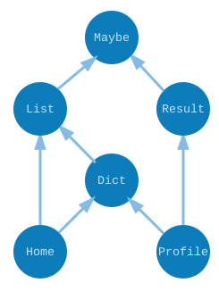

# Traversing Graphs

Say we have an Elm project with two modules `Home` and `Profile`. Those modules `import` some modules from core which in turn import other modules. So in a simplified world, it is possible that we end up with the following dependency graph:



If we run `elm make Home.elm` we want to compile as few files as possible. From the graph, we can see that we only *need* to make sure that `Dict`, `List`, and `Maybe` are compiled. We can skip working on `Profile` and `Result` until later. Figuring all this out requires graph traversals!

> **Note:** The compiler is more sophisticated than what we are seeing here. For example, it keeps track of which files have “fresh” build artifacts, so even if it is a transitive dependency, we can skip rebuilding it and just reuse the build artifacts from before. There are many more tricks along these lines!


## Find the Dependencies

Say we just want to find the transitive dependencies of a module. We only want to know if the module is needed or not. We will start with a function with the type signature we want:

```elm
findDeps : String -> Dict String (List String) -> List String
findDeps root graph =
  ...
```

If we have a `graph` representing our imports, we want to find the list of all the modules reachable from a given `root` module.

Now our graph is pretty simple, but it is possible that someone created cyclic dependencies with their imports, so it is possible to run into repeats as we crawl the graph. If we do not check for this, we could end up crawling the graph forever! It sounds like we will need to track some extra information to detect that so let’s jump directly to our helper function strategy for writing recursive functions.

```elm
import Dict exposing (Dict)
import Set exposing (Set)

findDeps : String -> Dict String (List String) -> List String
findDeps root graph =
  findDepsHelp Set.empty [root] graph

findDepsHelp : Set String -> List String -> Dict String (List String) -> List String
findDepsHelp visited unvisited graph =
  case unvisited of
    [] ->
      Set.toList visited

    next :: rest ->
      ...
```

> **Exercise:** Stop reading and try to finish this yourself. It is definitely tricky, so just keep reading if you get stuck!

The base case is pretty easy. If there are no more `unvisited` nodes, we give back the `visited` nodes. Now in the other case, when we get to the `next` unvisited node, we want to explore its dependencies. We have to be careful though!

  - If it has not been `visited`, we want to get its dependencies and explore those as well.
  - If it *has* been `visited` we must ignore it or we could go into an infinite loop!

So we start by checking if `next` is in the `visited` set.

```elm
import Dict exposing (Dict)
import Set exposing (Set)

findDeps : String -> Dict String (List String) -> List String
findDeps root graph =
  findDepsHelp Set.empty [root] graph

findDepsHelp : Set String -> List String -> Dict String (List String) -> List String
findDepsHelp visited unvisited graph =
  case unvisited of
    [] ->
      Set.toList visited

    next :: rest ->
      if Set.member next visited then
        findDepsHelp visited rest graph
      else
        findDepsHelp (Set.insert next visited) ... graph
```

Okay, so if it is actually a new module, we need to add its dependencies to the `unvisited` list.

```elm
import Dict exposing (Dict)
import Set exposing (Set)

findDeps : String -> Dict String (List String) -> List String
findDeps root graph =
  findDepsHelp Set.empty [root] graph

findDepsHelp : Set String -> List String -> Dict String (List String) -> List String
findDepsHelp visited unvisited graph =
  case unvisited of
    [] ->
      Set.toList visited

    next :: rest ->
      if Set.member next visited then
        findDepsHelp visited rest graph
      else
        let
          newVisited =
            Set.insert next visited

          nextDeps =
            Maybe.withDefault [] (Dict.lookup next graph)

          newUnvisited =
            nextDeps ++ rest
        in
          findDepsHelp newVisited newUnvisited graph
```

So now we have a function that can tell us which dependencies are reachable. To actually do anything interesting in the compiler, we need to know what “order” they appear in. That way we know which ones to compile first, which ones we can compile in parallel, etc.

Anyway, there are a ton of cool things to do with graphs, and I hope this gives you a foothold that will help you explore it yourself!

> ## Stacks and Queues
>
> My favorite fact about graph traversals is that you can switch between [depth-first traversal](https://en.wikipedia.org/wiki/Depth-first_search) and [breadth-first traversal](https://en.wikipedia.org/wiki/Breadth-first_search) very easily! If `unvisited` is a stack, it is a depth-first traversal. If `unvisited` is a queue, it is a breadth-first traversal. In our code, we can switch by changing `newUnvisited` very slightly. Saying `nextDeps ++ rest` will be a depth-first, and saying `rest ++ nextDeps` will be breadth-first.
>
> I think this is pretty neat! And if you know you are going to be crawling every reachable node like a compiler, it is probably better to go with a depth-first traversal so that you keep less stuff in memory.
>
> ## Cyclic Dependencies
>
> With this intro to graphs, it should be easier to explain why Elm does not allow cyclic dependencies between modules.
>
> Say you have a cycle that goes through ten modules. It is *possible* to compile them. Rather than compiling them individually, you can take all the declarations from all ten modules and compile them together. You would need to do some renaming such that there were never name clashes, but that is no real trouble.
>
> The problem is that now, changing *any* of those ten files means you must recompile *all* of them. This makes it surprisingly easy to end up with long compile times. In the worst case, changing any file would result in recompiling every single module in your whole project.
>
> By disallowing cyclic module dependencies in Elm, we can be certain that changes in very large projects never *accidentally* creates a cyclic dependency. That means you do not need special tooling or discipline. The new hire can just edit code without the risk of one stray `import` making compilation 10x slower. As someone who worked with `#include` in C++ at Google, I feel confident that these sorts of decisions are a very big deal!