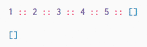

# Recursion

In most cases, you will not need to write your own custom recursive functions. You can usually rely on functions like `List.map` to transform data and functions like `List.foldl` to crawl over values and accumulate some information. Definitely prefer this approach!

Now, that said, you will occasionally find cases where you want to write your own recursive functions. I think most programmers just *feel* how to write functions like this, but that is extremely unhelpful as advice! I introspected on how I write recursive functions, and I recognized two major strategies that I use *all the time*. I hope they help you out!


## Strategy One - Pretend You Are Done

When writing recursive functions, there are two crucial steps:

  1. **Start with a `case`.** Destructure your data and see how far you can get with each branch.
  2. **Pretend you are done.** Pretend you already implemented the function and try to use it!

So imagine we want to get the length of a list without `List.length` or `List.foldl`. Step one is to use `case` on our list:

```elm
length : List a -> Int
length list =
  case list of
    [] ->
      ...

    first :: rest ->
      ...
```

Great, those are the two scenarios. If the list is empty, the length is zero, so we can fill that in.

```elm
length : List a -> Int
length list =
  case list of
    [] ->
      0

    first :: rest ->
      ...
```

In the other case, we get the `first` value and another list representing the `rest` of the values in the list. Well, we know we have one value, but how long is the `rest`? Remember step two: **pretend you are done**. That is what `length` is supposed to do, so let’s just use that!

```elm
length : List a -> Int
length list =
  case list of
    [] ->
      0

    first :: rest ->
      1 + length rest
```

It definitely takes time to get your brain trained to think this way, just like it took time for `for` loops to feel natural. The only way to improve is to practice! Speaking of practice...

> **Exercise:** Define a `sum` function that adds up all the integers in a list.
>
> ```elm
sum : List Int -> Int
sum list =
  ...
```
>
> Remember to (1) use `case` and (2) pretend you are done!


## Strategy Two - Helper Functions

The “pretend you are done” strategy is neat, but sometimes it is not enough. If you ever find yourself thinking that you feel like you need more information to make it work, it is time to create a helper function! Let’s see how this works with the `reverse` function.

```elm
reverse : List a -> List a
reverse list =
  ...
```

One way to approach this would be to chomp elements from one list and put them directly on a second list like this:



This means we want to keep track of a *second* list as we recurse through the first list. When you need extra information, break the recursion into a helper function with more arguments like this:

```elm
reverse : List a -> List a
reverse list =
  reverseHelp list []

reverseHelp : List a -> List a -> List a
reverseHelp list reversedList =
  ...
```

This `reverseHelp` function is going to be recursive, so like always we should try to (1) use `case` and (2) pretend we are done. So first we break up the `list`:

```elm
reverse : List a -> List a
reverse list =
  reverseHelp list []

reverseHelp : List a -> List a -> List a
reverseHelp list reversedList =
  case list of
    [] ->
      ...

    first :: rest ->
      ...
```

If `list` is empty, we want to give back the `reversedList`. If `list` has a `first` element, we want to put it on `reversedList` and keep going.

```elm
reverse : List a -> List a
reverse list =
  reverseHelp list []

reverseHelp : List a -> List a -> List a
reverseHelp list reversedList =
  case list of
    [] ->
      reversedList

    first :: rest ->
      reverseHelp rest (first :: reversedList)
```

And there we go, a `reverse` implementation!

This `foo` and `fooHelp` pattern is quite common. The `fooHelp` part lets you carry around extra state around as you recurse through some data structure, and the `foo` part lets you hide those details from people using the function. So `reverseHelp` carries an extra list around, and `reverse` gives the initial `[]` to make the public API nicer.

Like with the first strategy, the best way to get used to thinking this way is to practice!

> **Exercises:** Reimplement `length` with strategy two. Only make changes in `lengthHelp` though!
>
>     length : List a -> Int
>     length list =
>       lengthHelp list 0
>
>     lengthHelp : List a -> Int -> Int
>     lengthHelp list lengthSoFar =
>       ...
>
> When you get that, do the same for the `sum` function.
>
>     sum : List a -> Int
>     sum list =
>       ...
>
> For the sake of this exercise, the `sum` function can never call itself!


## Summary

We covered the two main strategies in writing recursive functions:

  1. Use `case` and pretend you are done.
  2. Create a `fooHelp` function that carries extra state around.

Both come up any time you need to write a recursive function yourself. That should be relatively rare given library functions like `List.foldl`, `Dict.map`, etc. but at least now you are better prepared for when the time comes!

Finally, it definitely takes some time to get used to thinking this way, just like it took time to get used to thinking with `for` loops. **Do not get discouraged!** It is hard for everyone at first, and the only real way to get acclimated is to practice!

> **More Exercises:** A great way to practice writing recursive functions is to try to implement everything in the `List` library yourself. Some good ones to try are:
>
>  - [`member : a -> List a -> Bool`](http://package.elm-lang.org/packages/elm-lang/core/latest/List#member)
>  - [`take : Int -> List a -> List a`](http://package.elm-lang.org/packages/elm-lang/core/latest/List#take)
>  - [`drop : Int -> List a -> List a`](http://package.elm-lang.org/packages/elm-lang/core/latest/List#drop)
>  - [`repeat : Int -> a -> List a`](http://package.elm-lang.org/packages/elm-lang/core/latest/List#repeat)
>  - [`range : Int -> Int -> List Int`](http://package.elm-lang.org/packages/elm-lang/core/latest/List#range)
>  - [`map : (a -> b) -> List a -> List b`](http://package.elm-lang.org/packages/elm-lang/core/latest/List#map)
>  - [`map2 : (a -> b -> result) -> List a -> List b -> List result`](http://package.elm-lang.org/packages/elm-lang/core/latest/List#map2)
>
> Try using strategy one and two on each and see how they go. Try to get a feel for when to reach for them.
