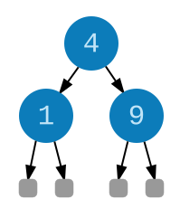
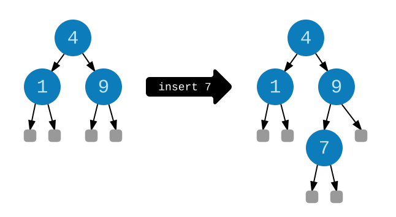

# Binary Trees

A great way to get more familiar with recursion is to work with **binary trees**. What are those? A binary tree is either *empty* or it is a *node* with a value and two subtrees. Those subtrees are either empty or a node with two subtrees. Etc. Here is a visual representation:



Notice that every node has two subtrees. That is what makes this a *binary* tree. We can represent this data structure in Elm with a union type:

```elm
type Tree a
  = Empty
  | Node a (Tree a) (Tree a)
```

So the tree in the image above would be represented like this:

```elm
exampleTree : Tree Int
exampleTree =
  Node 4 (Node 1 Empty Empty) (Node 9 Empty Empty)
```

To make it easier to work with these trees, we need to write a bunch of recursive functions!


## Member

Say we are curious if `9` is in `exampleTree`? As humans it is easy to see that it is, but how can we devise a system to make it easy for computers too? Well, say we maintain some **invariants** about our trees:

  1. All values *left* of a `Node` must hold *lower* values.
  2. All values *right* of a `Node` must hold *higher* values.

If we always follow these rules, we always know whether to go right or left from any node! So if we were looking for `9` we know it must be to the right of `4`. There it is! If we are looking for `7` we know it must be to the right of `4`. From there we know it must be left of `9`. Dead end. It is not in the tree. How do we write this as code though?

Well, we can always start with a `case`.

```elm
member : comparable -> Tree comparable -> Bool
member target tree =
  case tree of
    Empty ->
      ...

    Node value left right ->
      ...
```

If the `tree` is `Empty` we know we have not found the `target` value.

```elm
member : comparable -> Tree comparable -> Bool
member target tree =
  case tree of
    Empty ->
      False

    Node value left right ->
      ...
```

We also know that if `target` is less than `value` it will be in the `left` subtree. Let’s try to check that.

```elm
member : comparable -> Tree comparable -> Bool
member target tree =
  case tree of
    Empty ->
      False

    Node value left right ->
      if target < value then
        ...
      else
        ...
```

At this point we need to search the `left` subtree, so let’s pretend we are done with `member` and use it.

```elm
member : comparable -> Tree comparable -> Bool
member target tree =
  case tree of
    Empty ->
      False

    Node value left right ->
      if target < value then
        member target left
      else
        ...
```

We can do roughly the same thing if `target` is greater than `value`.

```elm
member : comparable -> Tree comparable -> Bool
member target tree =
  case tree of
    Empty ->
      False

    Node value left right ->
      if target < value then
        member target left
      else if target > value then
        member target right
      else
        ...
```

If the `target` is not less than `value` and it is not greater than `value`, it must be equal to `value`. That means we found our target!

```elm
member : comparable -> Tree comparable -> Bool
member target tree =
  case tree of
    Empty ->
      False

    Node value left right ->
      if target < value then
        member target left
      else if target > value then
        member target right
      else
        True
```

There we go. A function that can find values in any tree.

> **Note:** This means `member` is relatively cheap as you get more and more values. Say you have a binary tree that is ten levels deep. That means it holds about 1023 values. Checking for a value will be ten steps or fewer!


## Insert

Now we know how to check if values are in the tree, but how do we add new values? Remember the **invariants** we described for `member`? Lower values go left, higher values go right. If we want to insert `7` to `exampleTree`, we need to follow those rules:



Now we want to turn that into code. The logic seems pretty similar to `member` so we will start with the same basic skeleton.

```elm
insert : comparable -> Tree comparable -> Tree comparable
insert target tree =
  case tree of
    Empty ->
      ...

    Node value left right ->
      if target < value then
        ...
      else if target > value then
        ...
      else
        ...
```

If the `tree` is `Empty`, we want to insert our `target` value. The only thing we can really do here is say `Node target Empty Empty` to switch from a tree with *no* values to a tree with *one* value.

```elm
insert : comparable -> Tree comparable -> Tree comparable
insert target tree =
  case tree of
    Empty ->
      Node target Empty Empty

    Node value left right ->
      if target < value then
        ...
      else if target > value then
        ...
      else
        ...
```

Now if `target` is less than `value`, we know it needs to be inserted into the `left` subtree. We can pretend `insert` is done and use that.

```elm
insert : comparable -> Tree comparable -> Tree comparable
insert target tree =
  case tree of
    Empty ->
      Node target Empty Empty

    Node value left right ->
      if target < value then
        Node value (insert target left) right
      else if target > value then
        ...
      else
        ...
```

Notice that we do not just call `insert` directly! We want to preserve the existing tree, just making a minor change to the `left` subtree. We can do the same thing if `target` is greater than `value`.

```elm
insert : comparable -> Tree comparable -> Tree comparable
insert target tree =
  case tree of
    Empty ->
      Node target Empty Empty

    Node value left right ->
      if target < value then
        Node value (insert target left) right
      else if target > value then
        Node value left (insert target right)
      else
        ...
```

Same idea but we `insert` on the `right` subtree. In the final case we know that `target == value` which means this value is already in the tree. That means we have nothing to insert.

```elm
insert : comparable -> Tree comparable -> Tree comparable
insert target tree =
  case tree of
    Empty ->
      Node target Empty Empty

    Node value left right ->
      if target < value then
        Node value (insert target left) right
      else if target > value then
        Node value left (insert target right)
      else
        tree
```

Great, now our `insert` function will work exactly like the picture above if we evaluate `insert 7 exampleTree`. So if we wanted to make it easier to define binary trees, we could create a `fromList` function that just inserts a bunch of values:

```elm
fromList : List comparable -> Tree comparable
fromList list =
  List.foldl insert Empty list

-- exampleTree = fromList [4,1,9]
```

It looks like `fromList` may be quite expensive because calling `insert` creates a “totally new” binary tree. Thanks to immutability, it is actually pretty cheap!

Imagine we have a binary tree that is ten levels deep and it is totally full. It would hold about 1024 values. We are going to `insert` a value higher than all the others, so it should be added as the rightmost node. At the root, we know we need to `insert` on the right, so we can reuse the entire `left` subtree containing about 500 values. We need to go right again, so we can again reuse that `left` subtree which contains about 250 values. Etc.

In the end, we only need to replace the nodes that lead directly to the new entry in the tree. That means ten allocations, or about 1% of nodes. Sharing these massive subtrees between old and new trees does not cause any tricky bugs because all the values are immutable. That means someone from far away cannot sneakily mutate your tree!

> **Note:** The `Dict` and `Set` libraries are actually *balanced* binary trees meaning that we do a bit of extra work to guarantee that the trees never get too lopsided. This is how we provide dictionaries that are fast *and* immutable.


## Depth and Map

Here are two more examples that may be helpful to look through. The `depth` function figures out how many levels are in a tree:

```elm
depth : Tree a -> Int
depth tree =
  case tree of
    Empty ->
      0

    Node v left right ->
      1 + max (depth left) (depth right)
```

And the `map` function transforms every value in the tree:

```elm
map : (a -> b) -> Tree a -> Tree b
map func tree =
  case tree of
    Empty ->
      Empty

    Node v left right ->
      Node (func v) (map func left) (map func right)
```

Both recursive functions were discovered using the “pretend you are done” strategy.


> ## Exercises
>
> **Exercise 1:** Get the sum of all the values in a tree.
>
>     sum : Tree Int -> Int
>     sum tree =
>       ...
>
> **Exercise 2:** Flatten a tree into a list.
>
>     flatten : Tree a -> List a
>     flatten tree =
>         ...
>
> Try flattening it in different ways. Can you make it so the values are in-order in the resulting list? Can you use the `foo` and `fooHelp` technique to build up an in-order list without using `(++)`?
> **Exercise 3:** Write a fold function for trees. The fold function does not need to guarantee a particular order of traversal.
>
>     fold : (a -> b -> b) -> b -> Tree a -> b
>     fold add answerSoFar tree =
>       ...
>
> **Exercise 4:** Use `fold` to define `member`, `sum`, and `flatten`.
>
> **Exercise 5:** Try implementing `fold` with a bunch of different traversal strategies. Good ones to try are [pre-order](https://en.wikipedia.org/wiki/Tree_traversal#Pre-order), [in-order](https://en.wikipedia.org/wiki/Tree_traversal#In-order), and [post-order](https://en.wikipedia.org/wiki/Tree_traversal#Post-order).